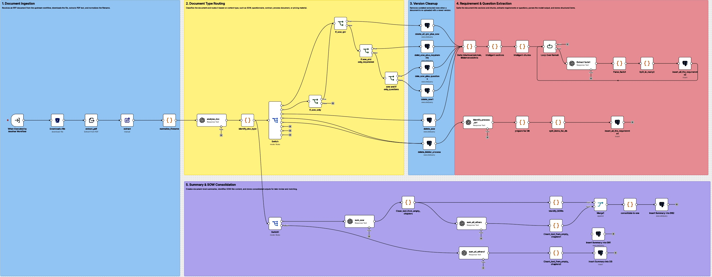
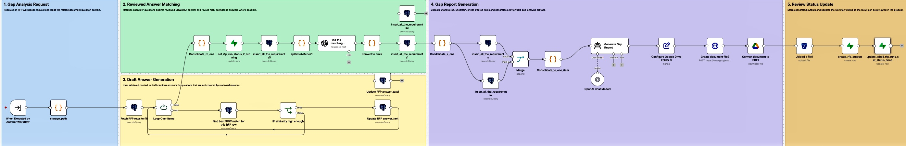

# Lytcon Bid Analysis

AI-assisted RFP analysis pipeline for discovering public-sector tenders, processing RFP documents, extracting requirements, and supporting bid/no-bid decisions.

## Overview

Lytcon Bid Analysis is a workflow-driven system for working with public-sector tender and RFP documents.

Tender documents are often long, inconsistent, and difficult to evaluate manually. Important information is spread across PDFs, service descriptions, SLA sections, pricing documents, appendices, and technical specifications.

The goal of this project is to turn messy tender input into structured, reviewable information that can support faster and more consistent bid decisions.

## Live Product

A public-facing version of the product concept is available at:

https://lytcon.de

The product is designed for IT service providers that need to review tender opportunities, understand requirements, and prepare bid-related artifacts more efficiently.

## What the System Does

The system is designed to:

- discover relevant tender opportunities
- collect tender metadata and document links
- ingest RFP documents
- extract text from PDFs
- classify document types
- split documents into relevant sections and chunks
- extract requirements, facts, questions, and SOW-related information
- support retrieval-assisted gap analysis
- generate reviewable bid artifacts such as summaries, gap reports, and proposal drafts

## High-Level Architecture

```text
Tender source
        ↓
Tender discovery / scraper logic
        ↓
Document links and metadata
        ↓
Document ingestion
        ↓
PDF/text extraction
        ↓
Document classification and chunking
        ↓
AI-assisted requirement extraction
        ↓
Structured review outputs
        ↓
Gap analysis and bid-support artifacts
```

## Workflow Examples

### 1. Tender Discovery


**Tender Discovery Workflow**  
Discovers relevant public-sector IT tenders across TED and DTVP, handles source-specific retrieval, normalizes metadata, validates procurement document links, and hands usable document targets into the RFP analysis pipeline.

### 2. RFP Document Classification and Extraction



**RFP Document Classification and Extraction**  
Transforms raw RFP files into structured requirements, questions, summaries, and SOW signals through classification, routing, chunking, extraction, and review-oriented storage.

### 3. Retrieval-Assisted Gap Analysis



**Retrieval-Assisted Gap Analysis**  
Matches open RFP questions against reviewed SOW/Q&A content, drafts cautious answers for unresolved items, and generates a reviewable gap-analysis artifact.

## Product Screenshots

### Tender Detail View


**Tender Detail View**  
Shows normalized tender metadata and allows a relevant opportunity to be added into the RFP processing workflow.

### Document Upload Flow


**Document Upload Flow**  
Allows users to upload RFP documents and start the downstream document classification and extraction pipeline.

### RFP Workspace


**RFP Workspace**  
Shows the review workspace after an RFP has been structured, including open questions, requirement coverage, deadlines, and output generation actions.

## Core Components

- Next.js frontend for product and workspace views
- Next.js / Node-based scraper logic for tender discovery and document handling
- n8n workflows for orchestration
- PDF extraction and document classification
- AI-assisted requirement and fact extraction
- retrieval-assisted gap analysis
- Supabase / PostgreSQL for structured data storage
- Cloudflare R2 for document storage
- structured output generation for bid review

## Scraper and Document Retrieval

The scraper layer is responsible for discovering relevant tender opportunities, resolving document links, validating downloadable artifacts, and passing documents into the RFP analysis pipeline.

The most relevant technical pieces include:

- browser automation for unstable procurement portals
- source-specific retrieval for TED and portal-based tender systems
- URL validation and safety checks
- candidate scoring for likely document links
- document download validation
- upload handoff into document storage
- workflow trigger into the analysis pipeline

## Data Model

The system does not treat AI summaries as the final output.

Instead, extracted information is stored as structured rows that can be reviewed, filtered, compared, and reused in downstream workflows.

Example row types include:

- capability
- limitation
- pricing
- contract_term
- ambiguity
- missing_information

This structure helps separate covered requirements, risky requirements, missing information, and items that require human review.

## Retrieval and Matching

Retrieval is used where exact keyword matching is too brittle.

Example use cases include:

- matching RFP questions against reviewed SOW/Q&A content
- retrieving relevant capability information when wording differs
- identifying requirements that are covered, partially covered, or unclear
- supporting cautious draft answers for human review

The system is not designed to treat generated answers as final truth. Reviewed content is preferred where available, and uncertain outputs remain reviewable.

## Example Output

```json
[
  {
    "question": "Can the provider offer 24/7 support for priority 1 incidents?",
    "status": "covered",
    "matched_source": "Managed support SOW",
    "draft_answer": "Yes. The support model includes 24/7 coverage for priority 1 incidents.",
    "review_required": true
  },
  {
    "question": "Can the provider guarantee a 30-minute response time?",
    "status": "needs_review",
    "matched_source": "SLA profile",
    "draft_answer": "The internal SLA profile references critical incident response targets, but the exact 30-minute commitment requires confirmation.",
    "review_required": true
  },
  {
    "question": "Is a named service manager included?",
    "status": "unclear",
    "matched_source": null,
    "draft_answer": "No confirmed source was found. This should be reviewed before submission.",
    "review_required": true
  }
]
```

## Repository Structure

```text
.
├── README.md
├── images/
│   ├── workflow-tender-discovery.png
│   ├── workflow-rfp-document-extraction.png
│   └── workflow-gap-analysis.png
├── frontend/
│   └── screenshots/
│       ├── tender-detail.png
│       ├── document-upload-flow.png
│       └── rfp-workspace.png
├── workflows/
│   ├── tender-discovery.md
│   ├── rfp-document-extraction.md
│   └── gap-analysis.md
├── scrapers/
│   └── architecture.md
├── examples/
│   ├── sample-rfp-input.md
│   ├── extracted-requirements.json
│   ├── gap-analysis-output.json
│   └── embedding-match-example.json
└── sql/
    └── requirement_match_schema.sql
```

## My Role

I founded Lytcon and built the core product logic behind this system.

My work included:

- designing the RFP analysis pipeline
- building n8n workflows for document processing and gap analysis
- creating scraper logic in a Next.js / Node environment
- building the public-facing product website and workspace UI
- designing SQL structures for requirement and match rows
- working with Supabase / PostgreSQL
- experimenting with retrieval and embedding-based matching
- connecting frontend product flows with backend workflow automation
- structuring the system around reviewable bid decisions instead of generic AI summaries

## Current Status

This repository documents the architecture, workflows, and product direction behind Lytcon Bid Analysis.

It is not presented as a finished production platform. The current focus is on validating tender discovery, document processing, requirement extraction, retrieval-assisted gap analysis, and review-oriented bid-support workflows.

## What This Project Demonstrates

This project demonstrates the ability to:

- work with messy real-world procurement data
- design workflow-based document processing pipelines
- connect frontend product flows with backend automation
- combine scraper logic, document extraction, structured storage, and review workflows
- use AI as part of a larger system rather than as a standalone chatbot
- think in structured data models instead of plain summaries
- build software around operational decision support
