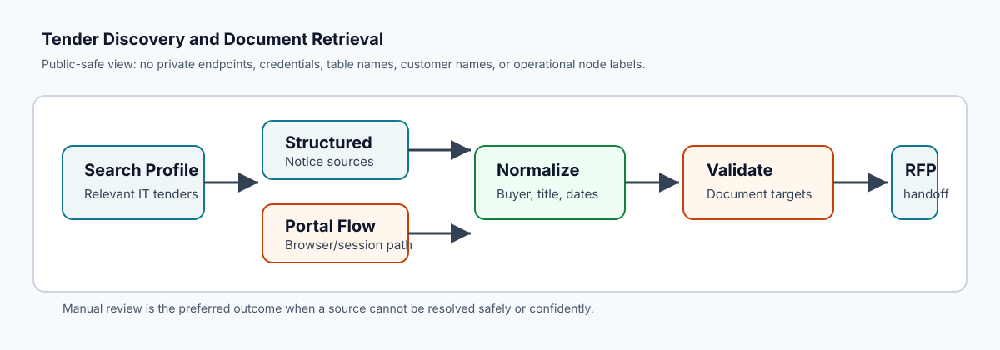
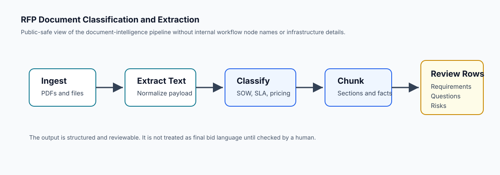
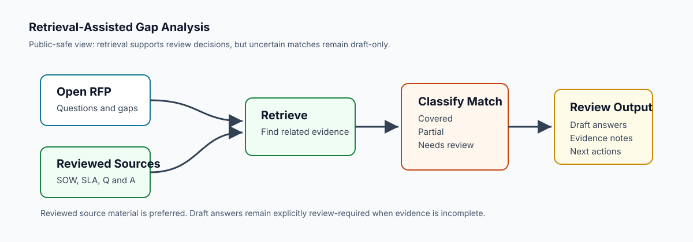
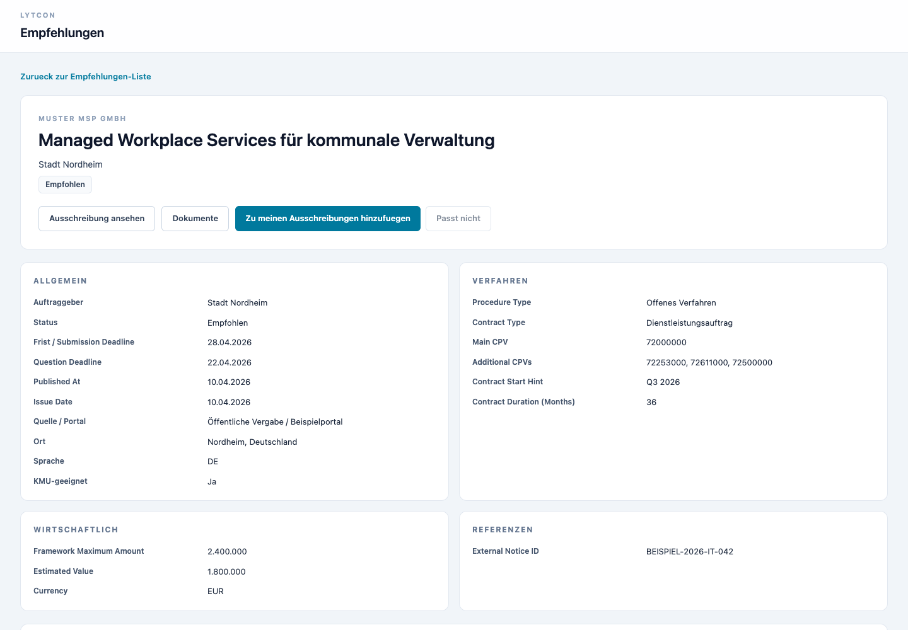
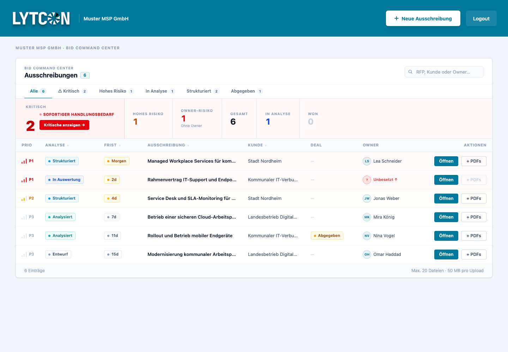
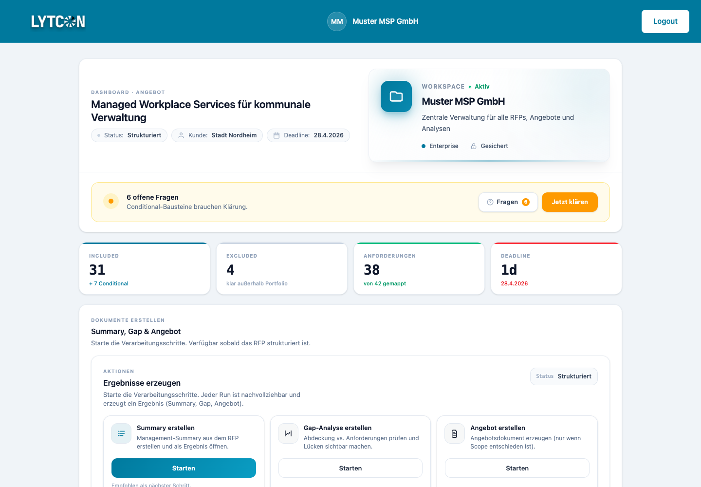
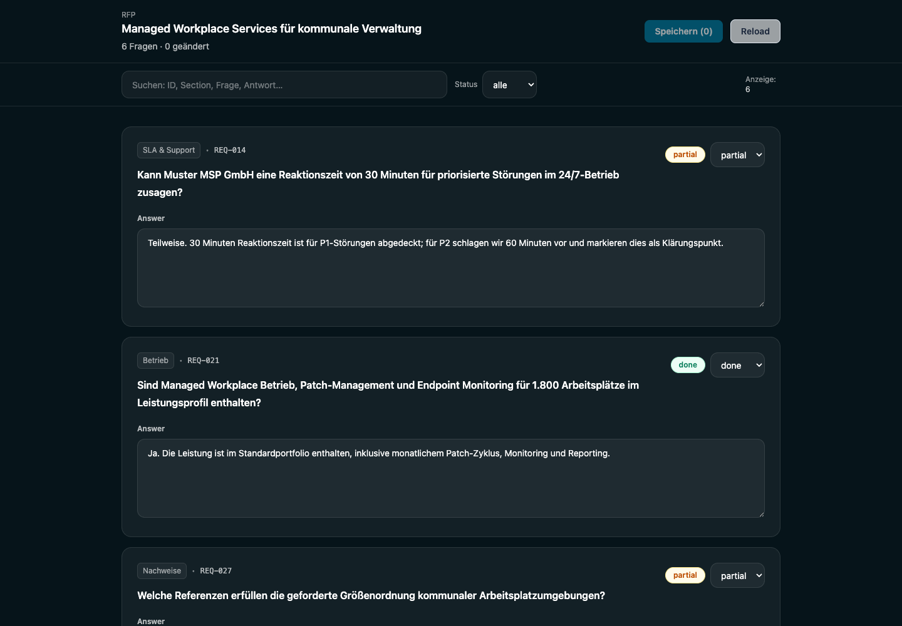
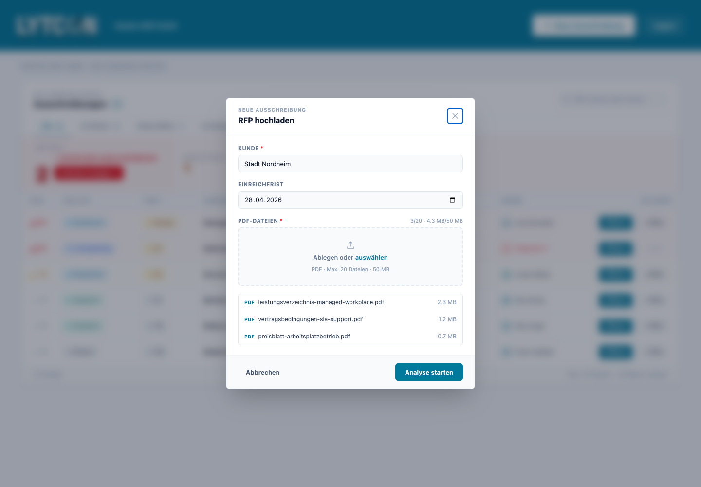

# Lytcon Bid Analysis

Lytcon Bid Analysis is an early technical case study for finding, retrieving, and structuring public-sector IT tender documents so that bid teams can review requirements, risks, and open questions more systematically.

The repository is intentionally scoped as a public-safe portfolio version. It shows the workflow design, example data structures, SQL model, scraper/document-retrieval architecture, and selected product screens. It does not contain private credentials, customer data, live workflow endpoints, or a complete production deployment.

## Problem

Public-sector IT tenders are difficult to evaluate because the useful information is scattered across inconsistent sources:

- notices may appear in structured feeds, portal pages, PDFs, ZIP packages, or external procurement systems
- document links are often indirect, hidden behind portal navigation, or mixed with announcements and legal boilerplate
- requirements, deadlines, exclusions, pricing signals, and service obligations are spread across multiple documents
- bid teams need reviewable evidence, not just a generated summary

This project explores how to turn that messy input layer into structured review work: discover the opportunity, retrieve the right documents, extract requirements, match them against known service/SOW content, and surface uncertain items for human review.

## What This Repository Contains

| Area | What is included | Status |
| --- | --- | --- |
| Tender discovery | Public-safe workflow documentation for finding relevant IT tenders and resolving document targets | Documented workflow |
| Scraper/document retrieval | Architecture notes for source-specific portal handling, candidate scoring, URL validation, and document handoff | Prototype architecture |
| RFP extraction | Workflow documentation for PDF ingestion, document classification, chunking, and requirement/question extraction | Documented workflow |
| Gap analysis | Example retrieval-assisted matching flow for open RFP questions against reviewed SOW/Q&A content | Documented workflow |
| SQL/data model | Simplified schema and review queries for requirement match rows | Public-safe example |
| Examples | Fictional RFP input, extracted items, and retrieval match output | Demo data |
| Product screens | Screenshots of tender detail review, upload, dashboard, workspace, and question review | Synthetic/sanitized UI examples |

## System Workflow

```text
Tender sources
  -> discovery and source-specific retrieval
  -> normalized tender metadata and validated document targets
  -> document ingestion and storage
  -> PDF/text extraction
  -> document classification and chunking
  -> requirement and question extraction
  -> structured review rows
  -> retrieval-assisted gap analysis
  -> human-reviewed bid-support outputs
```

The important design choice is that generated text is not treated as the final artifact. The system tries to preserve structure, status, source context, and review state so a human can decide what is safe to use in a bid.

## Why The Technical Problem Is Non-Trivial

Tender analysis is not just "upload a PDF and summarize it." The system has to handle several failure modes before analysis is useful:

- source variability between TED-style notices and portal-specific procurement systems
- document links that require browser/session behavior rather than static HTML parsing
- false positives such as login pages, help pages, announcement PDFs, or unrelated navigation links
- metadata extraction errors where labels, IDs, city names, or boilerplate can be mistaken for real tender fields
- stale or duplicate uploaded documents
- uncertain requirement matches where similar wording does not prove contractual coverage

The architecture therefore separates discovery, retrieval, extraction, matching, and review instead of collapsing everything into one prompt or one workflow.

## Key Components

### Code And Orchestration Boundary

n8n is used as the orchestration layer: it connects ingestion steps, storage handoffs, document processing, extraction, and review workflows. The project does not rely on n8n as a substitute for backend logic.

Several parts of this domain are better expressed as deterministic code because AI agents and workflow tools can make brittle decisions around URLs, document candidates, field extraction, and requirement matching. The public-safe JavaScript modules in `src/` show the kind of backend logic that sits behind the workflows:

- URL safety validation for public tender links
- document candidate scoring and ranking
- document target extraction from portal links
- requirement parsing from RFP text
- retrieval-style gap matching against reviewed source content

These modules are intentionally small and testable. They are reference implementations, not a full production scraper.

### 1. Tender Discovery

The tender discovery workflow builds a focused search profile for public-sector IT opportunities, branches between structured notice sources and portal-specific sources, normalizes metadata, validates document candidates, and hands usable targets into the RFP analysis pipeline.



This workflow is documented in [`workflows/tender-discovery.md`](workflows/tender-discovery.md).

### 2. Scraper And Document Retrieval Layer

The scraper layer is responsible for making the messy public-source boundary explicit. It is designed to:

- inspect tender notices and portal pages
- detect whether a page is a notice, project page, login page, document page, or blocked flow
- identify likely document packages or PDFs
- score candidates based on link text, file type, surrounding context, and source behavior
- reject unsafe or low-confidence targets
- return a manual-review status instead of guessing when retrieval is uncertain

The architecture notes are in [`scrapers/architecture.md`](scrapers/architecture.md).

### 3. RFP Document Classification And Extraction

Once documents are available, the extraction workflow turns raw RFP files into structured review data. It covers PDF extraction, document-type classification, routing, section/chunk creation, requirement extraction, and persistence of extracted items.



This workflow is documented in [`workflows/rfp-document-extraction.md`](workflows/rfp-document-extraction.md).

### 4. Retrieval-Assisted Gap Analysis

The gap-analysis workflow matches open RFP questions against reviewed SOW/Q&A content. High-confidence reviewed material can be reused; uncertain matches become draft answers that still require human review.



This workflow is documented in [`workflows/gap-analysis.md`](workflows/gap-analysis.md).

## Data Model

The SQL example models extracted and matched findings as reviewable rows rather than final prose. Each row carries fields such as:

- `row_type`: capability, limitation, pricing, contract term, ambiguity, or missing information
- `polarity`: whether the finding is positive, negative, or neutral for bid evaluation
- `importance`: review priority
- `source_scope`: whether the evidence came from the RFP, SOW, SLA, pricing, merged content, or gap analysis
- `comparison_text`, `raw_value`, and `normalized_value`
- `review_status`: needs review, reviewed, approved, or rejected

See [`sql/requirement_match_schema.sql`](sql/requirement_match_schema.sql) and [`sql/example_queries.sql`](sql/example_queries.sql).

Example review query:

```sql
select
  row_type,
  polarity,
  importance,
  service_name,
  comparison_text,
  raw_value,
  normalized_value,
  notes,
  review_status
from organization_requirement_match_rows
where importance = 'high'
  and row_type in ('limitation', 'ambiguity', 'missing_information')
order by created_at desc;
```

## Example Data

The `examples/` folder contains fictional, public-safe examples:

- [`sample-rfp-input.md`](examples/sample-rfp-input.md): a short synthetic RFP excerpt
- [`sample-extracted-items.json`](examples/sample-extracted-items.json): structured requirements extracted from the sample
- [`sample-embedding-match.json`](examples/sample-embedding-match.json): cautious retrieval-assisted matching output

The retrieval example is intentionally conservative: similarity can find relevant source material, but it does not automatically prove that a bid requirement is covered.

## Product Screens

The screenshots use synthetic/demo data and are included to show the user workflow, not production usage.



Tender detail review with normalized procurement metadata and the handoff from discovery into an RFP workspace.



Bid command center that prioritizes RFPs by deadline pressure, analysis state, owner risk, and next action.



Workspace view showing requirement coverage, open questions, deadline pressure, and actions for generating review artifacts.



Question review queue where extracted requirements and draft answers remain editable and status-driven.



Document upload flow for adding tender files before downstream classification and extraction.

## Implemented, Documented, And Experimental

| Category | Current state |
| --- | --- |
| Implemented/prototyped | Product screens, workflow diagrams, JavaScript reference modules, example schemas, example review queries, retrieval/matching examples, scraper architecture notes |
| Documented but environment-specific | n8n orchestration, storage handoffs, portal-specific retrieval, RFP processing triggers |
| Experimental | Portal coverage, document candidate scoring, retrieval thresholds, gap-answer drafting, bid-support output generation |
| Not claimed | Production readiness, complete portal coverage, fully automated bid submission, customer deployment, security certification |

## Design Principles

- Prefer reviewable structured rows over untraceable summaries.
- Keep uncertain answers separate from reviewed evidence.
- Treat document retrieval as its own reliability problem.
- Return manual-review states when the system cannot confidently resolve a document or requirement.
- Use public-safe examples in this repository instead of exposing live operational configuration.

## Limitations

This repository should be read as an early technical artifact, not a finished enterprise product.

- The public repo does not include runnable credentials, live n8n endpoints, or production infrastructure.
- Workflow screenshots are documentation artifacts and may not be directly runnable outside the original environment.
- Portal retrieval remains source-specific and requires ongoing testing because procurement portals change.
- The SQL schema is a simplified public example, not a full database migration history.
- Example data is synthetic and should not be interpreted as customer traction or production validation.

## Repository Structure

```text
.
├── README.md
├── examples/
│   ├── README.md
│   ├── sample-rfp-input.md
│   ├── sample-extracted-items.json
│   └── sample-embedding-match.json
├── frontend/
│   └── screenshots/
├── images/
│   ├── sanitized-tender-discovery.svg
│   ├── sanitized-rfp-document-extraction.svg
│   └── sanitized-gap-analysis.svg
├── scrapers/
│   └── architecture.md
├── src/
│   ├── extraction/
│   │   └── requirementParser.js
│   ├── matching/
│   │   └── gapMatcher.js
│   └── retrieval/
│       ├── candidateScoring.js
│       ├── documentTargets.js
│       └── urlSafety.js
├── sql/
│   ├── requirement_match_schema.sql
│   └── example_queries.sql
└── workflows/
    ├── tender-discovery.md
    ├── rfp-document-extraction.md
    └── gap-analysis.md
```

## Why I Built This

I built this project to understand a real operational problem: how IT service providers can make better bid/no-bid and response decisions when tender information is fragmented across public portals, documents, and internal service knowledge.

The work forced me to make practical technical tradeoffs: where browser automation is useful, where structured SQL matters more than prose, where automation should stop for human review, and how to explain a messy workflow clearly enough for both technical and non-technical users.

## Relevance To Palantir-Style Work

This project is relevant because it deals with an ambiguous real-world workflow rather than a clean toy problem. It required independent learning across scraping, workflow orchestration, SQL modeling, document processing, product design, and user review flows.

The most important part is not that the system is finished. It is that the repository shows a builder trying to impose structure on messy operational data, make uncertainty visible, and design software around human decision-making.
