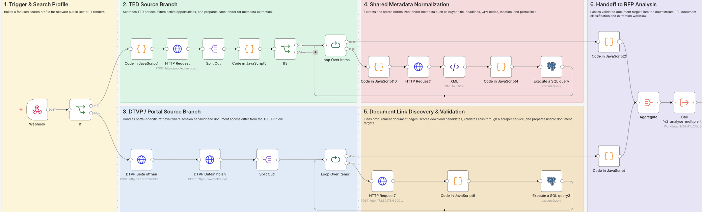

# Tender Discovery Workflow

## Purpose

Find relevant public-sector IT tenders, resolve procurement document links, and hand usable document targets into the ingestion pipeline.

## What it proves

This workflow demonstrates tender discovery, portal/API integration, relevance filtering, document-link resolution, download-candidate validation, and handoff from scraping into downstream processing.

## Main steps

1. Build a focused public-sector IT tender search profile.
2. Search a public tender source and split returned notices.
3. Filter relevant IT/cloud workplace tenders.
4. Fetch tender metadata and resolve procurement document links.
5. Validate downloadable candidates through an internal scraper service.
6. Store the normalized tender record and send documents to ingestion.

## Why this matters

Tender discovery is where the system first turns noisy public procurement sources into a controlled pipeline. The workflow shows that Lytcon is not only analyzing files after manual upload; it can find relevant opportunities, normalize messy portal data, and pass validated document candidates into downstream processing.

## Redactions

This public copy redacts private endpoints, tokens, credential names, customer-specific names, table names, and internal infrastructure details.

## Current status

This workflow copy is intended for documentation and portfolio review. It preserves the main system logic but may require environment-specific credentials and endpoints to run.
